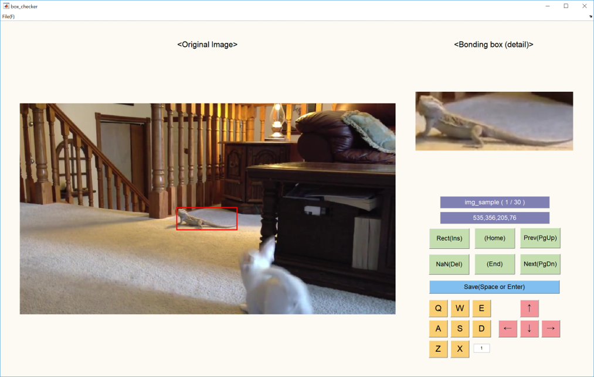

# Make_GT_boundingbox

----------
## Usage

1. Load image (click the file button or keyboard shortcut "f")
2. Draw a rectangle (click the Rect button or keyboard shortcut "insert")
3. Save the result (click the Save button or keyboard shortcut "space")
4. Adjust the position and size of the ground truth target 

(size adjustment : **qweasdzx**, position adjustment : **keyboard arrows**)

5. Also save the result
Repeat progress...

----------
## Keyboard shortcut description

### Size adjustment
#### "More smaller"
* Q : width and height
* A : width only
* S : height only
  
#### "More larger"
* E : width and height
* D : width only
* W : height only
  
#### "Step size"
* Z : decrease
* X : increase
  
### Position adjustment
* Uparrow : up
* Downarrow : down
* Leftarrow : left
* Rightarrow : right
  
### Run button
* fileopen(f) : find the folder and open the image file
* Save(space) : save and go to the next frame
* Rect(Ins) : find position by using your mouse (getrect function)
* NaN(Del) : delete the present result 
* (Home) : go to home '[w/o save]'
* (End) : go to end (Last frame in which the result exists) '[w/o save]'
* Prev(PgUp) : go to the previous frame '[w/o save]'
* Next(PgDn) : go to the next frame '[w/o save]'
